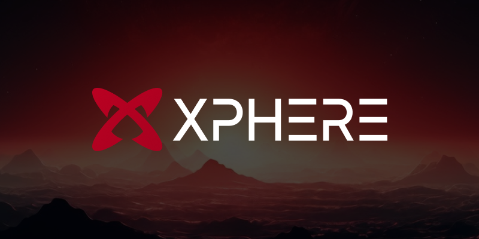

# Introduction

<figure><figcaption></figcaption></figure>

## Xphere Blockchain White-paper : Crafting the Future&#x20;

## Global WEB 3.0 Integrated Ecosystem

## Xpherience Beyond Universe : Connect Human

This whitepaper is the 2024. April. edition, detailing the technical structure and operational principles of the Xphere blockchain. The contents herein are based on the forward-looking technological advancements and innovative approaches that Xphere aspires to. However, technology is continuously evolving, and the descriptions and methodologies described in this document may change based on new discoveries or research outcomes.

## Introduction

Blockchain technology is an innovative endeavor that combines distributed ledgers and cryptographic techniques to overcome the constraints of centralized systems. In a landscape where many blockchain projects struggle to realize their true potential due to technical complexity, lack of user experience, and scalability issues, Xphere stands as a forward-thinking project aiming to overcome these obstacles and pursue real-world applications.

Xphere prioritizes the practical usability of blockchain technology. Our goal is to apply blockchain technology in real-world scenarios. The Xphere project encompasses the following key elements:

1. **User-Centric Design**\
   Xphere aims to provide a platform that users can intuitively understand and use, thereby transforming blockchain technology into an everyday tool.&#x20;
2. **Real-World Applications**\
   Our project focuses on applying blockchain technology to real-world problems, such as supply chain, education, healthcare, government, etc.&#x20;
3. **Scalability and Performance**\
   We research and implement various technological solutions to enhance scalability and performance, ensuring that the network can meet the performance demands of large-scale users and guarantee scalability.&#x20;
4. **Collaboration and Ecosystem Building**\
   Through collaboration with various stakeholders, our project aims to build and expand the blockchain ecosystem. By fostering collaboration with diverse stakeholders, we create a robust blockchain ecosystem and promote the practical utilization of technology through collaboration in technology, business models, and regulatory aspects.

