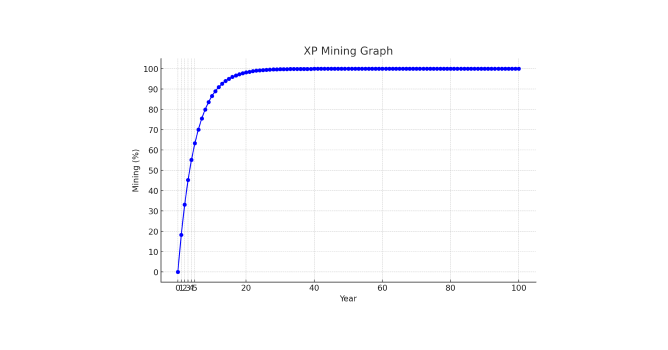

# XP

## Native Coin – XP Coin

XP Coin is the primary internal cryptocurrency that can be transferred within Xphere. It is used to pay transaction fees when creating and executing smart contracts or transferring crypto assets. XP Coin plays an essential role as fuel to operate the mainnet network for the decentralized application called Xphere. The transaction fee for XP is 1018 peb.

### Xphere (XP) Coin Overview

<table data-full-width="true"><thead><tr><th width="223">Category</th><th>Content</th><th data-hidden></th></tr></thead><tbody><tr><td>Project Name</td><td>Xphere</td><td></td></tr><tr><td>Ticker</td><td>XP</td><td></td></tr><tr><td>Consensus Method</td><td>HAP (PoW + Dual Chain Core Network Algorithm)</td><td></td></tr><tr><td>Total Supply</td><td>5,500,000,000 (55 billion, mining period of 100 years)</td><td></td></tr><tr><td>Launch Date</td><td>March 2024</td><td></td></tr><tr><td>Halving Rule</td><td>Approximately every 4 years (18% decrease annually)</td><td></td></tr></tbody></table>

<figure><figcaption>
XP Mining Graph
</figcaption></figure>

### Xphere Tokenomics Overview

In the dynamic realm of blockchain technology, strategic token allocation is crucial to ensuring long-term sustainability and robust ecosystem growth. Xphere's token allocation strategy is designed to balance immediate operational needs with the requirements of long-term strategic growth initiatives.&#x20;

While the token economies of various blockchain projects have traditionally focused solely on the technical aspect of network maintenance, providing incentives only to node operators (miners or block producers), this overlooks the importance of providing incentives to other participants who contribute to network expansion or invest in long-term growth.&#x20;

Xphere's token economy is designed to allow a wide range of participants to contribute to the ecosystem in diverse ways and be rewarded accordingly. Additionally, it will have a structure that can continuously supply resources to support future growth plans or strategically planned investment projects, beyond blockchain node operations.

### Funding Structure

Xphere's funding structure will operate continuously alongside the creation of the Xphere network's genesis block. The total XP issued in each new block, along with the sum of transaction fees used in the blocks, will be aggregated and distributed to designated accounts according to predetermined ratios.&#x20;

1. **Ecosystem (50%)**\
   The largest portion of token allocation will be allocated to strategic partnerships with venture capital (VC), alliances, and distributed application (dApp) projects to promote ecosystem growth. This fund is critical in supporting and promoting innovative applications and services that enhance the utility of the Xphere blockchain.&#x20;
2. **Foundation (30%)**\
   These tokens will support fundamental aspects of Xphere operations, including research and development, network operations, strategic reserves, and funding for new technology initiatives that support a broader ecosystem.&#x20;
3. **Marketing and Community (20%)**\
   This allocation supports marketing efforts and community engagement initiatives aimed at building a strong user base, enhancing brand visibility, and facilitating global outreach to potential users and developers.

