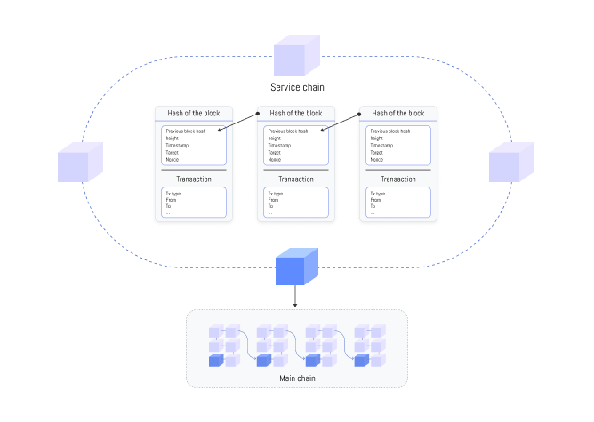
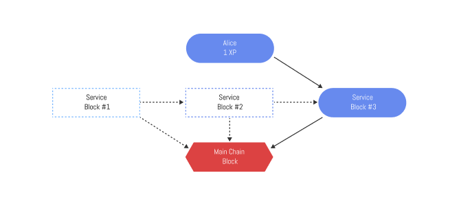

# Service Chain

Xphere blockchain plans to adopt service chains as primary sub-networks in the future.
A service chain network consists of auxiliary blockchains operated independently by decentralized applications (dApps) within the Xphere ecosystem. The service chain network connects to the main chain network through nodes that generate transactions and process data requests. Blockchain applications operate within the service chain based on nodes they install themselves.
Blockchain application operators can expect stable and fast transaction processing speeds by establishing application-specific execution environments with high TPS and customizable network policies in service chains.

### Implementation of Service Chains

Xphere's service chain is an independent auxiliary blockchain separated from the main chain. Initially, the service chain will be composed of a single network, but nodes can be specially configured to meet the needs of individual blockchain applications (dApps) in the future. Additionally, separate blockchains with customized security levels or high throughput that may be inconvenient or impossible on the main chain can be implemented.


Existing fully decentralized scalability solutions face challenges such as difficult interfaces or immediate finality restrictions. Therefore, Xphere's service chain may partially sacrifice complete decentralization for better usability, immediate finality, high performance, and availability.

### Connection Between Service Chains and Main Chain

Service chains can be directly connected to the main chain through cross-transaction methods or employ bridge methods to consider operational efficiency.


When using bridges to connect service chains and the main chain, the operation of multiple bridges can be considered. If only one bridge is used in a service chain, that bridge can become a point of transaction failure. To address this, a multi-bridge system can be established with at least two bridges. If there are at least two bridges connected, even if one bridge encounters connectivity issues, data anchoring and token transfers between chains can still be performed successfully through another bridge.


The connection method between service chains and the main chain will be determined through detailed review of technical factors in the future.

<figure><figcaption>
Service Chain Structure Diagram
</figcaption></figure>

### Data Anchoring

Since Xphere's service chains can be used for various service-specific objectives, data anchoring can be effectively utilized.


Data anchoring is a solution to detect changes in data of a specific blockchain. It involves periodically including the hash value of transaction data or block data from one blockchain into transactions on another blockchain. Xphere, being a public blockchain, will address potential security vulnerabilities in service chains with relatively low node counts by regularly storing the block hashes of service chains on the main chain.

<figure><figcaption>
Data Anchoring Structure Diagram
</figcaption></figure>

