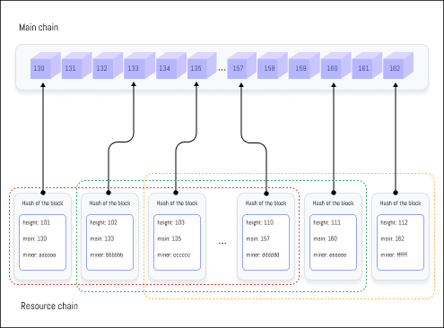

# Hypothesis Acceptance Procedure(HAP)

The Hypothesis Acceptance Procedure (HAP) of Xphere is a crucial function that dramatically enhances the speed and security of the network. With the introduction of a dual-chain structure, the Xphere network enables fast transaction processing while maintaining decentralization. The HAP is an innovative approach designed to minimize various risks, especially those that could temporarily disrupt or interfere with the network.

### Specific Steps of the Hypothesis Acceptance Procedure (HAP):

1. **Hypothesis Generation**\
   Participants who successfully mine and are selected as validators attach their digital signatures to the block header they create, forming a hypothesis. These signatures serve to validate the block and authenticate its issuer.
2. **Hypothesis Synchronization**\
   All validators synchronize the hypothesis data generated on the network, ensuring that all validators have identical information about the network's state and the progress of blocks.
3. **Hypothesis Selection**\
   In cases where different hypothesis data exists, the network selects the most rational and optimal hypothesis according to predefined rules. This maximizes network efficiency and enhances the reliability of distributed consensus.
4. **Hypothesis Broadcasting**\
   Validators who haven't selected the optimal hypothesis broadcast this information to the entire network along with additional signatures supporting the optimal hypothesis. This fosters overall network consensus for the final block decision.
5. **Block Decision**\
   Based on synchronization results, if over 66% of validators support the same hypothesis, the block is ultimately decided according to that hypothesis. This process significantly improves the network's processing speed and responsiveness.

Security Advantages of the Hypothesis Acceptance Procedure: The most significant security advantage of the HAP is that the IP addresses of validators remain undisclosed. This makes the Xphere network much more resilient against network attacks like DDoS. By maintaining anonymity of validator identities and locations during the block decision process, external attackers find it difficult to target specific nodes.

Xphere's Hypothesis Acceptance Procedure opens up new possibilities in blockchain technology by simultaneously providing fast transaction processing speed and high network security. This plays a crucial role in Xphere's leadership in shaping the future of blockchain technology.

<figure><figcaption>
Hypothesis Acceptance Procedure(HAP) Structural Diagram
</figcaption></figure>

